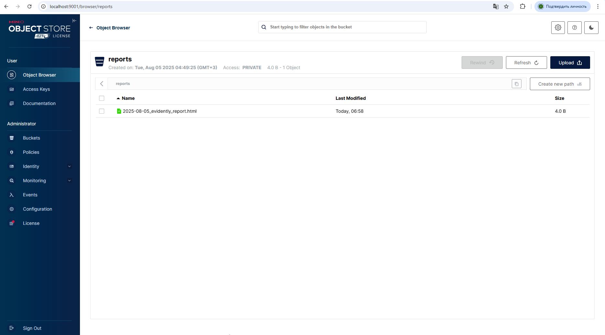

# MLOps Pipeline for California Housing Dataset

## Project Description
Complete MLOps pipeline for California housing price prediction using:
- Apache Airflow 2.8.1 (Python 3.9)
- MLflow for experiment tracking
- MinIO S3 for artifact storage
- Evidently AI for data monitoring
- FastAPI for prediction service

## Data Source
Built-in scikit-learn dataset `fetch_california_housing()`:
- 20,640 records
- 8 numerical features:
  - MedInc - median income
  - HouseAge - median house age
  - AveRooms - average rooms
  - AveBedrms - average bedrooms
  - Population - population
  - AveOccup - average occupancy
  - Latitude - latitude
  - Longitude - longitude
- Target variable: MedHouseVal (median house value)

## Project Structure

```
mlops-california-housing/
├── airflow/          # Airflow DAGs and config
├── api/              # FastAPI service
├── mlflow/           # MLflow config
├── minio/            # MinIO config
├── scripts/          # Training and monitoring scripts
├── docker-compose.yml
├── Makefile
└── README.md
```

## Getting Started

```bash
make up  # Start all services
```

Services will be available at:
- Airflow: http://localhost:8080 (admin/admin)
- MLflow: http://localhost:5000
- MinIO: http://localhost:9000 (minioadmin/minioadminpassword)
- API: http://localhost:8000

## Key Components

### 1. Model Training
- `model_training` DAG trains RandomForestRegressor
- Logs parameters and metrics to MLflow
- Saves model to MinIO (s3://mlflow)

### 2. Data Monitoring
- Daily `model_monitoring` DAG:
  - Generates Evidently data drift reports
  - Saves reports to MinIO (s3://reports)
  - Triggers retraining if thresholds exceeded

### 3. Prediction API
FastAPI service endpoints:
- `/predict` - get price prediction
- `/health` - service healthcheck

Example request:
```bash
curl -X POST "http://localhost:8000/predict" \\
-H "Content-Type: application/json" \\
-d '{
  "MedInc": 8.3252,
  "HouseAge": 41.0,
  "AveRooms": 6.984127,
  "AveBedrms": 1.023810,
  "Population": 322.0,
  "AveOccup": 2.555556,
  "Latitude": 37.88,
  "Longitude": -122.23
}'
```

Example response:
```json
{"prediction": 4.526}
```

## Project Management

Main commands:
```bash
make up      # Start services
make down    # Stop services
make logs    # View logs
make test    # Test API request
make clean   # Full cleanup
```

## Configuration
All environment variables are set in `.env` file:
- MinIO access credentials
- MLflow connection settings
- Airflow parameters

## Screenshots


