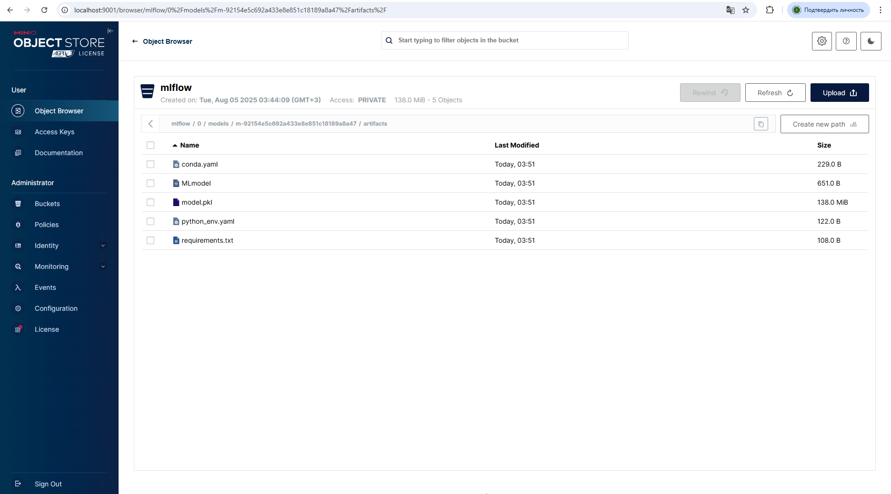

# MLOps Pipeline for California Housing Dataset

## Описание проекта
Полный MLOps-пайплайн для предсказания цен на жилье в Калифорнии с использованием:
- Apache Airflow 2.8.1 (Python 3.9)
- MLflow для трекинга экспериментов
- MinIO S3 для хранения артефактов
- Evidently AI для мониторинга данных
- FastAPI для сервиса прогнозов

## Исходные данные
Используется встроенный датасет scikit-learn `fetch_california_housing()`:
- 20,640 записей
- 8 числовых признаков:
  - MedInc - средний доход
  - HouseAge - средний возраст домов
  - AveRooms - среднее число комнат
  - AveBedrms - среднее число спален
  - Population - население
  - AveOccup - средняя заполняемость домов
  - Latitude - широта
  - Longitude - долгота
- Целевая переменная: MedHouseVal (медианная стоимость дома)

## Архитектура проекта

```
mlops-california-housing/
├── airflow/          # DAGs и конфигурация Airflow
├── api/              # FastAPI сервис
├── mlflow/           # Конфигурация MLflow  
├── minio/            # Конфигурация MinIO
├── scripts/          # Скрипты обучения и мониторинга
├── docker-compose.yml
├── Makefile
└── README.md
```

## Запуск проекта

```bash
make up  # Запуск всех сервисов
```

Сервисы будут доступны:
- Airflow: http://localhost:8080 (admin/admin)
- MLflow: http://localhost:5000
- MinIO: http://localhost:9000 (minioadmin/minioadminpassword)
- API: http://localhost:8000

## Основные компоненты

### 1. Обучение модели
- DAG `model_training` обучает RandomForestRegressor
- Логирует параметры и метрики в MLflow
- Сохраняет модель в MinIO (s3://mlflow)

### 2. Мониторинг данных
- Ежедневный DAG `model_monitoring`:
  - Генерирует отчет Evidently о дрейфе данных
  - Сохраняет отчеты в MinIO (s3://reports)
  - Запускает переобучение при превышении порогов

### 3. Прогнозирование через API
FastAPI сервис предоставляет эндпоинты:
- `/predict` - получение прогноза стоимости
- `/health` - проверка работоспособности

Пример запроса:
```bash
curl -X POST "http://localhost:8000/predict" \\
-H "Content-Type: application/json" \\
-d '{
  "MedInc": 8.3252,
  "HouseAge": 41.0, 
  "AveRooms": 6.984127,
  "AveBedrms": 1.023810,
  "Population": 322.0,
  "AveOccup": 2.555556,
  "Latitude": 37.88,
  "Longitude": -122.23
}'
```

Пример ответа:
```json
{"prediction": 4.526}
```

## Управление проектом

Основные команды:
```bash
make up      # Запуск сервисов
make down    # Остановка сервисов  
make logs    # Просмотр логов
make test    # Тестовый запрос к API
make clean   # Полная очистка
```

## Настройки
Все переменные окружения заданы в `.env` файле:
- Данные для доступа к MinIO
- Настройки подключения к MLflow
- Параметры Airflow

## Скриншоты



